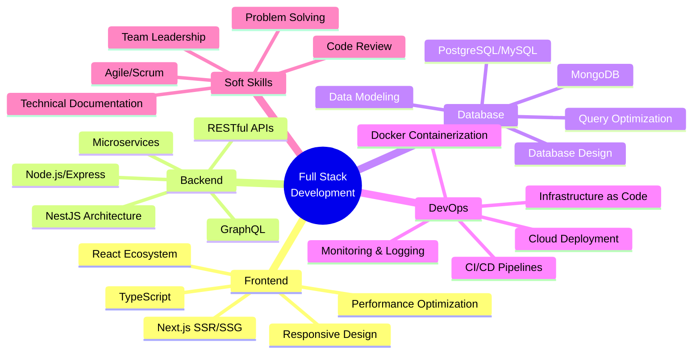

<div align="center">

# 👋 Hi, I'm Sakib

### 🚀 Full Stack MERN Developer | Building Digital Excellence

[](https://yourportfolio.com)
[](https://linkedin.com/in/yourprofile)
[](https://twitter.com/yourhandle)
[](mailto:your.email@example.com)


</div>

---

## 🎯 About Me

```typescript
const developer = {
  name: "MD Sadman Hossain Sakib",
  role: "Full Stack MERN Developer",
  location: "🌍 Your Location",
  experience: "2+ years",
  currentFocus: "Building scalable web applications",
  learning: ["AI Integration", "Microservices", "System Design"],
  
  codePhilosophy: "Clean code, scalable architecture, user-first design",
  
  funFact: "I turn coffee ☕ into code 💻 and bugs into features 🚀"
};
```

<div align="center">

### 💼 **What I Bring to the Table**

🔹 **End-to-End Development** • From wireframe to deployment  
🔹 **Performance Optimization** • Lightning-fast, SEO-friendly applications  
🔹 **Cloud Native Solutions** • Scalable architecture on AWS & Vercel  
🔹 **Modern Tech Stack** • Latest frameworks and best practices  
🔹 **Team Collaboration** • Agile methodologies & effective communication

</div>

---

## 🛠️ Tech Arsenal

### **Frontend Development**
<div align="center">


</div>

### **Backend Development**
<div align="center">


</div>

### **Database & Storage**
<div align="center">


</div>

### **UI Frameworks & Libraries**
<div align="center">


</div>

### **DevOps & Cloud**
<div align="center">


</div>

### **Project Management & Collaboration**
<div align="center">


</div>

---

## 📊 GitHub Analytics

<div align="center">
  


</div>

<div align="center">
  
[](https://git.io/streak-stats)

</div>

---

## 🏆 GitHub Trophies

<div align="center">


</div>

---

## 💼 Featured Projects

<div align="center">

### 🌟 **Project Showcase**

</div>

<table align="center">
<tr>
<td width="50%">

### 🚀 **Project One**
[](https://project-link.com)
[](https://github.com/username/project)

**Tech Stack:** React, Node.js, MongoDB, AWS

A comprehensive e-commerce platform with real-time inventory management, payment integration, and advanced analytics dashboard.

🔹 **50K+** Monthly Active Users  
🔹 **99.9%** Uptime  
🔹 **2s** Average Load Time

</td>
<td width="50%">

### 💻 **Project Two**
[](https://project-link.com)
[](https://github.com/username/project)

**Tech Stack:** Next.js, NestJS, PostgreSQL, Docker

Enterprise-grade SaaS solution featuring role-based access control, real-time collaboration, and automated reporting.

🔹 **Scalable** Architecture  
🔹 **Real-time** Sync  
🔹 **Enterprise** Ready

</td>
</tr>

<tr>
<td width="50%">

### 🎨 **Project Three**
[](https://project-link.com)
[](https://github.com/username/project)

**Tech Stack:** TypeScript, Express, MySQL, Cloudflare

High-performance API serving 1M+ requests daily with advanced caching, rate limiting, and comprehensive monitoring.

🔹 **< 100ms** Response Time  
🔹 **1M+** Daily Requests  
🔹 **Global** CDN

</td>
<td width="50%">

### 🔐 **Project Four**
[](https://project-link.com)
[](https://github.com/username/project)

**Tech Stack:** React, Python, Supabase, Vercel

AI-powered analytics dashboard with predictive insights, automated reporting, and intuitive data visualization.

🔹 **AI-Powered** Insights  
🔹 **Real-time** Analytics  
🔹 **Cloud** Native

</td>
</tr>
</table>

---

## 📈 Contribution Graph

<div align="center">

[](https://github.com/ashutosh00710/github-readme-activity-graph)

</div>

---

## 🎓 Expertise & Specializations

<div align="center">



</div>

---

## 🌟 Achievements & Certifications

<div align="center">

| 🏅 Achievement | 📜 Description |
|:--------------|:---------------|
| **🎯 AWS Certified** | Solutions Architect Associate |
| **⚡ Performance Expert** | Optimized applications for 90+ Lighthouse scores |
| **🚀 Open Source Contributor** | 500+ contributions across various projects |
| **👥 Team Leadership** | Led teams of 5+ developers on enterprise projects |
| **📚 Tech Blogger** | 50K+ monthly readers on technical articles |
| **🎤 Conference Speaker** | Presented at 3 international tech conferences |

</div>

---

## 📝 Latest Blog Posts

<div align="center">

<!-- BLOG-POST-LIST:START -->
- 🚀 [Building Scalable MERN Applications: Best Practices 2024](https://yourblog.com/post1)
- ⚡ [Next.js 14 App Router: Complete Guide](https://yourblog.com/post2)
- 🐳 [Docker & Kubernetes for Full Stack Developers](https://yourblog.com/post3)
- 🔒 [Implementing JWT Authentication in NestJS](https://yourblog.com/post4)
- 📊 [Database Optimization Techniques for High-Traffic Apps](https://yourblog.com/post5)
<!-- BLOG-POST-LIST:END -->

➡️ [**More Articles...**](https://yourblog.com)

</div>

---

## 💡 Development Philosophy

<div align="center">

> ### "Code is like humor. When you have to explain it, it's bad." - Cory House

```typescript
class Developer {
  principles = [
    "Write clean, maintainable code",
    "Test-driven development",
    "Continuous learning",
    "Collaboration over competition",
    "User-centric design"
  ];
  
  approach() {
    return "Build fast, test thoroughly, deploy confidently";
  }
  
  mindset() {
    return "Every bug is a learning opportunity 🐛➡️💡";
  }
}
```

</div>

---

## 🤝 Let's Connect & Collaborate!

<div align="center">

### 💬 I'm always open to interesting conversations and collaboration opportunities!

**🔍 Looking for:**
- Exciting full-time opportunities
- Freelance projects
- Open source collaborations
- Technical mentorship

**💼 Available for:**
- Full Stack Development
- System Architecture Design
- Code Review & Optimization
- Technical Consultation

<br>

[](mailto:your.email@example.com)
[](https://linkedin.com/in/yourprofile)
[](https://twitter.com/yourhandle)
[](https://yourportfolio.com)
[](https://dev.to/yourusername)

<br>

### 📫 **Preferred Contact:** [your.email@example.com](mailto:your.email@example.com)

<br>


</div>

---

<div align="center">

### ⚡ Fun Fact

```javascript
while (alive) {
  eat();
  sleep();
  code();
  repeat();
}
```

<br>

### 🎯 "Building the future, one commit at a time"

<br>

**⭐ If you find my projects helpful, consider giving them a star!**

---

*Made with 💙 and lots of ☕*

[](https://forthebadge.com)
[](https://forthebadge.com)

</div>
